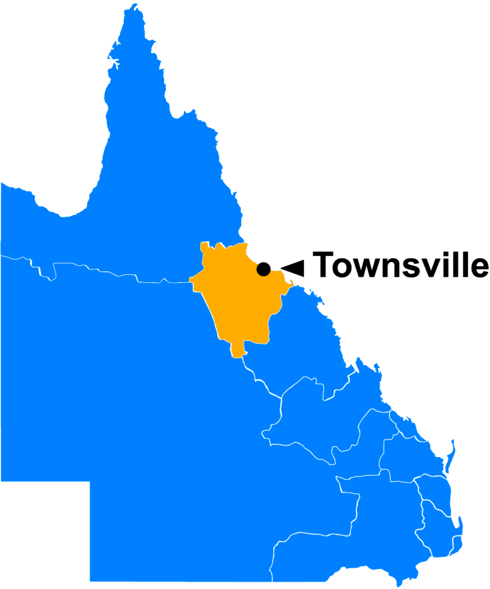
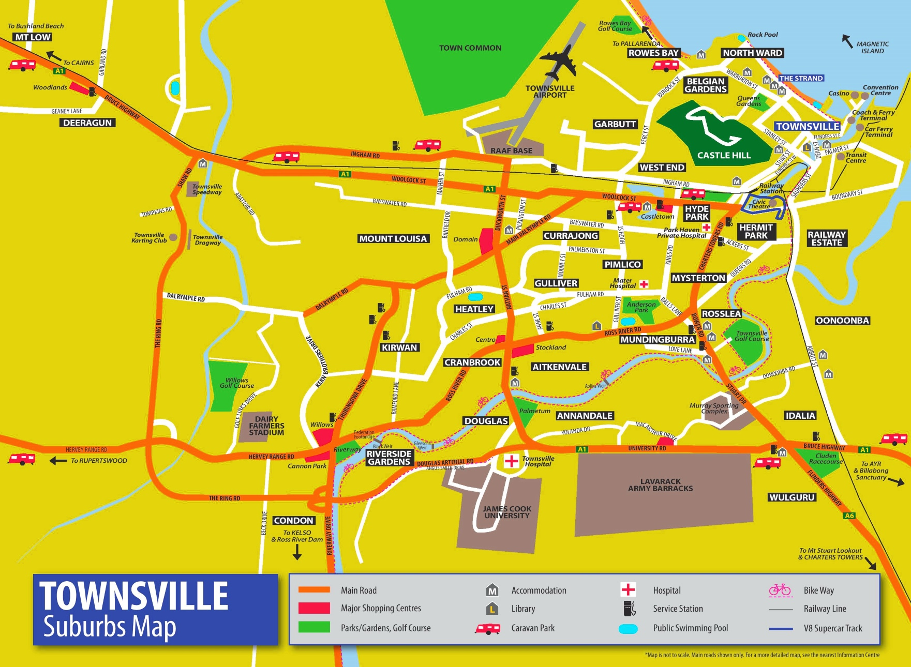

```{r setup, include=FALSE}
knitr::opts_chunk$set(fig.width=15, fig.height=10) 
```

Introduction
===================================== 

The analysis in the report is regarding **building certification lodgements** in the Townsville local government area. **Townsville is a city and a major port area in eastern Queensland, Australia.** Two data sets have been combined and used for the analysis from the  [www.data.gov.au](https://data.gov.au) website. 

First data set i.e. the building approval details have been extracted from [here](https://data.gov.au/data/dataset/tcc-building-approvals) and includes number of building approvals from 2009 to 2021 and their corresponding details e.g. Decision, Class, Suburb etc. And the second data set i.e. City of Townsville's Suburb geometry has been extracted from [here](https://data.gov.au/dataset/ds-dga-81cbbedc-e35f-4266-980d-21a6159b2404/distribution/dist-dga-28812258-4cf4-46aa-aa43-0206d7c60920/details?q=) and includes the geometrical values for these Suburbs.

**Project Details**

- Name: **Analyzing Building approvals data for the City of Townsville** (Assignment 4, ETC5513)

- Objective: Answering research questions regarding Year, Approvals, Class, Category, Suburb and Estimated Cost for Building Approvals in the city of Townsville.

**Research Questions**

1. To identify the year with maximum approvals and to analyze the data further to find out the suburb and estimate cost of building with respect to the most popular class in that year. And also find out the category that is most in demand for that class.

2. To analyze the suburb which was inferred from research question 1 and find out the year for which it had the maximum approvals. Also find out the class that occurred maximum times, category with respect to that class and estimate cost for these particular variables.


###
```{r img3, echo = F, out.width = '4%'}

```

###
```{r img2, echo = F, out.width = '5%'}
knitr::include_graphics("images/CTV.jpg")
```

###
```{r img, echo = F, out.width = '6%'}

```

Part A {data-navmenu="Section 1"}
===================================== 

**Variable Information and Explanation**

``` {r, echo= FALSE, warning= FALSE, message = FALSE}
library(tidyverse)
library(lubridate)
library(ggplot2)
library(kableExtra)
library(readr)
library(RColorBrewer)
library(randomcoloR)
library(plotly)
library(gapminder)
library(DiagrammeR)
library(ggmap)
library(maps)
library(wesanderson)
```


```{r, echo= FALSE, warning= FALSE, message = FALSE}
data <-read_csv("data/building-approvals.csv")
geometry <- read_csv("data/suburbs.csv")
question0 <- left_join(data, geometry)
```


### Table:1.1 **Names**
```{r, echo= FALSE, warning= FALSE, message = FALSE, fig.width= 3}
summary <- colnames(question0)
knitr::kable(summary, col.names = gsub("[.]", " ", names(summary)), align = "l", caption = "Variable Names") %>% 
kable_paper("hover")
```

### **Description**

Below is the description of the variables used in the dataset:

+ *Application type*: Here, application for 'building certification lodgements'.

+ *Date of decision notice*: The date the building certifier made a notice that the works met the building codes.

+ **Decision**: Current status of the works as recorded with Council.

+ **Class**: The building classification as per the list on page one.

+ *Sub-category (Council category descriptors)*: This category is a subdivision of class. Provides information regarding additions, alterations, subdwell etc in it.

+ **Category**: Townsville City Council has published on its website for a number of years a summary of building approval data using the certain categories.

+ *Estimated values*: The monetary value of the proposed building work.

+ *Suburb*: The suburb where the building work is taking place.

+ *Floor area*: The floor area of the building works in square metres.

+ *No. of units*: Number of individual units created or demolished by the building works.

+ *Electoral Division*: The local government electoral division in which the works are occurring.

+ **Latitude and Longitude**: Geometry dimensions 


Part B {data-navmenu="Section 1"}
===================================== 
Answering **Research Question 1**

Column {data-width=600}
-------------------------------------

### Fig:1.1 Finding **Year** with **maximum approvals** as a decision, overall.
```{r, echo= FALSE, warning= FALSE, message = FALSE, fig.height= 5, fig.width=12 }
question1 <- question0 %>% 
  mutate(`Date Of Decision Notice` = dmy(`Date Of Decision Notice`),
        Year = year(`Date Of Decision Notice`))

question1.1 <- question1 %>% 
  select(Year, Decision) %>% 
  count(Decision, Year) %>% 
  rename(`Total number of Decision` = n)

# plotting this graph
graph1 <- ggplot(data = question1.1, aes(x = Year,
                             y = `Total number of Decision`, 
                             fill = Decision)) +
  geom_bar(stat="identity", position = "dodge") +
  scale_fill_brewer(palette="Dark2")+
  theme(plot.title = element_text(hjust = 0.5))+
  theme_get() +
  xlab("Year") +
  ylab("Total count of Decision") 

ggplotly(graph1)
```


### Map: 1.2 Finding **class** occuring in maximum suburbs for approved projects in 2020.
```{r class}
question2 <- question1 %>% 
  filter(Decision %in% c("#Approved"),
         Year=="2020")
```

```{r plot2, fig.height= 5, fig.width=7}
map <- qmplot(Longitude, Latitude, data = question2 , size = I(1.5), darken = .3, fill= Class) 
ggplotly(map)
```

Column {data-height=650}
-------------------------------------

### Table: 1.3 Finding **class** occuring maximum times for approved projects in 2020.
```{r tab2, echo= FALSE, warning= FALSE, message = FALSE, fig.width=9.75, fig.height=10}
question2.1 <- question2 %>% 
  select(Year, Class) %>% 
  group_by(Year, Class) %>% 
  count(Class) %>% 
  rename(Count_of_Class = n) %>% 
  arrange(desc(Count_of_Class))
knitr::kable(head(question2.1)) %>% 
   kable_paper("hover", full_width = T) %>% 
  row_spec(1, bold = T, color = "white", background = "#D7261E")
```

### Results for Fig:1.1 and Fig:1.2

+ In the figure 1.1 the year **2020** has maximum **approvals** till now.

+ In figure 1.2 using *plotly*, we observe that **Class 1a** occurs in maximum suburbs.

### Result for Table 1.3

+ Table:1.3 gives us the total count of Class 1a. It shows that **Class 1a** has the **maximum count** out of all the other classes.

+ **Class 1a includes :Single dwelling, detached house, town house or villa unit.**


Section 2
===================================== 

Column {data-width=300}
-------------------------------------


```{r reading_data, message=FALSE, warning=FALSE,echo=FALSE}
sec2 <-read_csv("data/building-approvals.csv") %>% 
  mutate(`Date Of Decision Notice` = dmy(`Date Of Decision Notice`),
        Year = year(`Date Of Decision Notice`)) 
```


```{r filtering, message=FALSE, warning=FALSE,echo=FALSE}
Filtered <- sec2 %>%  
  filter(Class == "Class 1a", Decision == "#Approved")
grouping <- Filtered %>% 
    group_by(Category, Year) %>% 
  count(Category) %>% 
  rename(Count =n)
```


### Fig: 2.1 Finding **category** with maximum counts in Class 1a (approved projects), in 2020
```{r fig3, message=FALSE,warning=FALSE,echo=FALSE, fig.width=14}
df <- grouping
fig <- df %>%
  plot_ly(
    x = ~Category, 
    y = ~Count, 
    color = ~Category, 
    frame = ~Year, 
    type = 'scatter',
    mode = 'markers'
  )
fig
```


```{r colours, echo= FALSE, warning= FALSE, message = FALSE}
 c50 <- c(
  "dodgerblue2", "#E31A1C",  "green4", "#6A3D9A",  "#FF7F00", "black", "gold1", "skyblue2", "#FB9A99", "palegreen2", "#CAB2D6", "#FDBF6F","gray70", "khaki2", "maroon", "orchid1", "deeppink1", "blue1", "steelblue4",
  "darkturquoise", "green1", "yellow4", "yellow3", "darkorange4", "brown", "pink1", "violet", "mediumpurple1", "slateblue1", "purple", "purple3",
"turquoise2", "skyblue", "steelblue", "blue2", "navyblue", "orange", "tomato", "coral2", "palevioletred", "violetred", "red2","springgreen2", "yellowgreen", "palegreen4", "wheat2", "tan", "tan2", "tan3", "brown",
 "grey70", "grey50", "grey30"
)
```


### Fig: 2.2 Finding **Suburb** for *Residential category (Class 1a)*, *approved* projects in  *2020*
```{r fig4, message=FALSE, warning=FALSE, echo=FALSE, fig.width=14}
polar <- Filtered %>% 
  filter(Year == "2020") %>% 
  filter( Category == "Residential - Other") %>% 
  select(Suburb, Decision, Category, Year ) %>% 
  group_by(Suburb) %>% 
count(Decision) %>% 
  rename(Total_Approvals = n) %>% 
  arrange(desc(Total_Approvals))

ggplot(polar,
       aes(y = Total_Approvals, x = Suburb, fill = Suburb)) +
  geom_col() +
 coord_polar() +
scale_fill_manual(values = c50) +
theme(axis.text = element_blank())
```

Column {data-height=250}
-------------------------------------


```{r estimated-cost, echo= FALSE, warning= FALSE, message = FALSE}
cost <- sec2 %>% 
    filter(Year == "2020", Class == "Class 1a", Decision == "#Approved", Category == "Residential - Other") %>% 
  rename(Estimated_Cost = `Estimated Cost`) %>% 
mutate(Estimated.Cost = as.factor(Estimated_Cost)) 
  cost$Estimated.Cost = as.numeric(gsub("[\\$,]", "", cost$Estimated.Cost)) 
```

### Table: 2.3 Estimated cost for **Kirwan**
```{r tab3, echo= FALSE, warning= FALSE, message = FALSE, fig.width=5}
kirwan <- cost %>% 
  filter(Suburb == "Kirwan") 
k <- sum(kirwan$Estimated.Cost)
knitr::kable(head(k)) %>% 
   kable_paper("hover") %>% 
  row_spec(1, bold = T, color = "black", background = "white")
```


### Table: 2.4 Estimated cost for **Hermit Park**
```{r tab4, echo= FALSE, warning= FALSE, message = FALSE, fig.width=5}
hermit_park <- cost %>% 
  filter(Suburb == "Hermit Park") 
hp <- sum(hermit_park$Estimated.Cost)
knitr::kable(head(hp)) %>% 
   kable_paper("hover") %>% 
  row_spec(1, bold = T, color = "black", background = "#87CEEB")
```


### Table: 2.5 Total estimated cost for research question 1
```{r tab5, echo= FALSE, warning= FALSE, message = FALSE, fig.width=5}
s <- sum(k,hp)
knitr::kable(head(s)) %>% 
   kable_paper("hover") %>% 
  row_spec(1, bold = T, color = "black", background = "yellow")
```


Section 3
===================================== 
Answering **Research Question 2**: Finding **Year** and **class**  that occurs most no. of times for *approved projects* in *Kirwan* and *Hermit Park*, in *2021* and *2020* respectively.

Column {data-width=300}
-------------------------------------

```{r read, message=FALSE, warning=FALSE, echo=FALSE}
Section3 <- read_csv("data/building-approvals.csv") %>%  mutate(`Date Of Decision Notice` = dmy(`Date Of Decision Notice`),
        Year = year(`Date Of Decision Notice`))
```

### Fig: 3.1 Finding the **Year** for **maximum approvals** in **Kirwan** and **Hermit Park**.
```{r fig5, echo= FALSE, warning= FALSE, message = FALSE}
plot <- Section3 %>% 
  filter(Suburb %in% c("Kirwan" , "Hermit Park")) %>% 
  filter(Decision %in% c("#Approved")) %>% 
   group_by(Year, Decision, Suburb) %>% 
  count(Decision) %>% 
  rename(Decision_count = n)

Fig <- ggplot(data = plot, aes(x = Year,
                             y = Decision_count, 
                             fill = Suburb)) +
  geom_bar(stat="identity", position = "dodge") +
scale_fill_manual(values = wes_palette("GrandBudapest1", n = 2))+
  theme_minimal() +
  xlab("Year") +
  ylab("Approval Count") 

ggplotly(Fig)
```


Column {data-height=650}
-------------------------------------

### Table: 3.2  Count of Class in **Kirwan** in 2021
```{r tab6, echo=FALSE, warning=FALSE, message=FALSE}
table1 <- Section3 %>% 
  filter(Suburb == "Kirwan", Decision == "#Approved", Year == "2021") 
 
tab6 <- table1 %>% 
  group_by(Year, Class, Suburb, Decision) %>% 
  count(Class) %>% 
  rename(Class_count = n) %>% 
arrange(desc(Class_count))
knitr::kable(head(tab6)) %>% 
   kable_paper("hover") %>% 
  row_spec(1, bold = T, color = "white", background = "#D7261E")
```


### Table: 3.3 Count of Class in **Hermit Park** in 2020
```{r tab7, echo=FALSE, warning=FALSE, message=FALSE}
table2 <- Section3 %>% 
  filter(Suburb == "Hermit Park", Decision == "#Approved", Year == "2020") 
tab7 <- table2 %>% 
  group_by(Year, Class, Suburb, Decision) %>% 
  count(Class) %>% 
  rename(Class_count = n) %>% 
arrange(desc(Class_count))
knitr::kable(head(tab7)) %>% 
   kable_paper("hover") %>% 
  row_spec(1, bold = T, color = "white", background = "#D7261E")
```


Section 4
===================================== 

A. Out of *Class 10a* and *Class 1a*, finding **category** that is most in demand for *approved projects* in *Kirwan(2020)* and *Hermit Park(2021)* respectively.
B. *(Keeping, 'Decision as Approved', 'Category as Residential-Other','Suburbs as Kirwan   and Hermit Park',constant.*
*Keeping 'Year as 2021' and 'Class as 10a' constant for Kirwan.*
*Keeping 'Year as 2020' and 'Class as 1a' constant for Hermit Park.)*

Column {data-width=300}
-------------------------------------

```{r read-data, message=FALSE, warning=FALSE,echo=FALSE}
sec4 <-read_csv("data/building-approvals.csv") %>% 
  mutate(`Date Of Decision Notice` = dmy(`Date Of Decision Notice`),
        Year = year(`Date Of Decision Notice`)) 
```


```{r filter-kirwan, message=FALSE, warning=FALSE,echo=FALSE}
catK <- sec4 %>% 
    filter(Year == "2021", Decision == "#Approved", Suburb == "Kirwan", Class == "Class 10a") 
K <- catK %>% 
  group_by(Year,Class,Decision,Suburb,Category) %>% 
  count(Category) %>% 
rename(Category_count = n)

```


```{r filter-hp, message=FALSE, warning=FALSE,echo=FALSE}
catHP <- sec4 %>% 
    filter(Year == "2020", Class == "Class 1a", Decision == "#Approved", Suburb == "Hermit Park")
HP <- catHP %>% 
    group_by(Year,Class,Decision,Suburb,Category) %>% 
  count(Category) %>% 
rename(Category_count = n)
```


```{r colour, message=FALSE, warning=FALSE,echo=FALSE}
c6 <- c(
  "dodgerblue2", "darkturquoise", "green1",  "green4", "#6A3D9A",  "#FF7F00", "black")
```

### Fig: 4.1 Count of Categories for their respective Suburbs and Class, For 'Kirwan' in Class 10a (2021).
```{r}
ggplot(K,
       aes(y = Category_count, x = Class, fill = Category)) +
  geom_col() +
 coord_polar() +
  scale_fill_manual(values = c6) +
theme(axis.text = element_blank())
```

### Fig: 4.2 Count of Categories for their respective Suburbs and Class, For 'Hermit Park' in Class 1a (2020).
```{r}
ggplot(HP,
       aes(y = Category_count, x = Class, fill = Category)) +
  geom_col() +
 coord_polar() +
  scale_fill_manual(values = c6) +
theme(axis.text = element_blank())
```

Column {data-height=500}
-------------------------------------

```{r kirwan-filter, message=FALSE, warning=FALSE,echo=FALSE}
Ecost <- catK %>% 
  rename(Estimated_Cost = `Estimated Cost`) %>% 
mutate(Estimated.Cost = as.factor(Estimated_Cost)) 
  Ecost$Estimated.Cost = as.numeric(gsub("[\\$,]", "", Ecost$Estimated.Cost)) 
```

### Table: 4.3 Total estimated cost for research question 2 **(Kirwan)**
```{r tab8, message=FALSE, warning=FALSE,echo=FALSE, fig.width=5}
Kcost <- Ecost %>% 
    filter(Category == "Residential - Other") 
Ksum <- sum(Kcost$Estimated.Cost) 
    knitr::kable(head(Ksum), caption = "Total estimated cost for research question 2 (Kirwan)") %>% 
   kable_paper("hover") %>% 
  row_spec(1, bold = T, color = "black", background = "white")
```

```{r hp-filter, message=FALSE, warning=FALSE,echo=FALSE}
Ecosthp <- catHP %>% 
  rename(Estimated_Cost = `Estimated Cost`) %>% 
mutate(Estimated.Cost = as.factor(Estimated_Cost)) 
  Ecosthp$Estimated.Cost = as.numeric(gsub("[\\$,]", "", Ecosthp$Estimated.Cost)) 
```

### Table: 4.4 Total estimated cost for research question 2 **(Hermit Park)**
```{r tab9, message=FALSE, warning=FALSE,echo=FALSE, fig.width=5}
HPcost <- Ecosthp %>% 
    filter(Category == "Residential - Other") 
HPsum <- sum(HPcost$Estimated.Cost) 
    knitr::kable(head(HPsum), caption = "Total estimated cost for research question 2 (Hermit Park)") %>% 
   kable_paper("hover") %>% 
  row_spec(1, bold = T, color = "black", background = "#87CEEB")
```

### Analysis

+ It is evident from both the graphs that the **Residential-Other** category for *approved projects*, is in demand for *both suburbs* and *both classes* in their respective *years*.


+ By observing table, we know that the **total cost** for suburb *Kirwan* for *class 10a* *approved* projects(*Residential-Other* category) in *2020* is **$511,371**.

+ And from, we know that the **total cost** for suburb *Hermit Park* for *class 1a* *approved* projects(*Residential-Other* category) in *2021* is **$1,074,668**.

Part A {data-navmenu="Conclusion"}
===================================== 


Column {data-width=300}
-------------------------------------

### Chart 1: The result for the **first research question** is depicted below:
```{r fig7, fig.width=7, fig.height=5, echo= FALSE, warning= FALSE, message = FALSE}
grViz("digraph flowchart {
      # node definitions with substituted label text
      node [fontname = Helvetica, shape = rectangle]        
      tab1 [label = '@@1']
      tab2 [label = '@@2']
      tab3 [label = '@@3']
      tab4 [label = '@@4']
      tab5 [label = '@@5']
      tab6 [label = '@@6']
      tab7 [label = '@@7']
      tab8 [label = '@@8']
      tab9 [label = '@@9']

      # edge definitions with the node IDs
      tab1 -> tab2 ;
      tab2 -> tab3;
      tab3 -> tab4;
      tab4 -> tab5;
      tab4 -> tab6;
      tab5 -> tab7;
      tab6 -> tab8;
      tab7 -> tab9;
      tab8 -> tab9;
      }

      [1]: 'Maximum APPROVALS'
      [2]: 'Year of 2020'
      [3]: 'Maximum Projects : Class 1A'
      [4]: 'Belonging to: RESIDENTIAL - OTHER category'
      [5]: 'Maximum Projects at : KIRWAN Suburb'
      [6]: 'Maximum Projects at : HERMIT PARK Suburb'
      [7]: 'Estimated Cost: $993,644'
      [8]: 'Estimated Cost: $1,074,668'
      [9]: 'Total Cost: $2,068,312'
      ")
```


### Chart 2: The result for the **research question 2, Part A** *(Reverse analysis for Kirwan)* is depicted below:
```{r fig8, fig.width=7, fig.height=5, echo= FALSE, warning= FALSE, message = FALSE}
grViz("digraph flowchart {
      # node definitions with substituted label text
      node [fontname = Helvetica, shape = rectangle]        
      tab1 [label = '@@1']
      tab2 [label = '@@2']
      tab3 [label = '@@3']
      tab4 [label = '@@4']
      tab5 [label = '@@5']
     
      # edge definitions with the node IDs
      tab1 -> tab2 -> tab3 -> tab4 -> tab5;
      }

      [1]: 'KIRWAN Suburb'
      [2]: 'Maximum Approvals in: 2021'
      [3]: 'Maximum Projects: Class 10a'
      [4]: 'Belonging to: RESIDENTIAL - OTHER category'
      [5]: 'Estimated Cost: $511,371'
      
      ")
```

### The result for the **research question 2, Part B***(Reverse analysis for Hermit Park)* is depicted below:
```{r fig9, fig.width=7, fig.height=5, echo= FALSE, warning= FALSE, message = FALSE}
grViz("digraph flowchart {
      # node definitions with substituted label text
      node [fontname = Helvetica, shape = rectangle]        
      tab1 [label = '@@1']
      tab2 [label = '@@2']
      tab3 [label = '@@3']
      tab4 [label = '@@4']
      tab5 [label = '@@5']
     

      # edge definitions with the node IDs
      tab1 -> tab2 -> tab3 -> tab4 -> tab5;
      }

      [1]: 'HERMIT PARK Suburb'
      [2]: 'Maximum Approvals in: 2020'
      [3]: 'Maximum Projects: Class 1a'
      [4]: 'Belonging to: RESIDENTIAL - OTHER category'
      [5]: 'Estimated Cost: $1,074,668'
      
      ")

```

Column {data-height=200}
-------------------------------------

### **Conclusion** from Analysis

+ Here, we observe that, **all** the components for *Hermit Park* are **common** between flowchart and flowchart. In both the flowcharts, best (maximum approvals) year **2020**, project **Class 1a**, category **residential-other** and cost **$1,074,668** are common.

+ We can say that, for research question 2, Part B:
**the reverse Analysis for result 1 has been successful** 

### Final Result

+ Although, out of the approvals that took place in the year 2020 (best year with maximum approvals), maximum approvals were of Kirwan, but **this has not been the case vice-versa** and hence there is not much similarity between result 1 and result 2(PartA).

+ For result 1 and result 2(Part B), both the **flowcharts are depicting the reverse of each other**, giving the same information.


Part B {data-navmenu="Conclusion"}
===================================== 

Row {data-width=600}
-------------------------------------

###
```{r img4, echo = F, out.width = '5%'}

```


###
```{r img5, echo = F, out.width = '3%'}
knitr::include_graphics("images/qu.jpg")
```

Column {data-height=250}
-------------------------------------

###
**Credits** :

- Pranali angne (32355068)

- Nishtha arora (32296622)

- Raunak bhivpathaki (32230486)

###
```{r img6, echo = F, out.width = '0.1%'}
knitr::include_graphics("images/mon.png")
```

References
===================================== 

[1] D. Kahle and H. Wickham. ggmap: Spatial Visualization with ggplot2. The R
  Journal, 5(1), 144-161. URL
  http://journal.r-project.org/archive/2013-1/kahle-wickham.pdf
  
[2] Original S code by Richard A. Becker, Allan R. Wilks. R version by Ray
  Brownrigg. Enhancements by Thomas P Minka and Alex Deckmyn. (2018). maps: Draw
  Geographical Maps. R package version 3.3.0.
  https://CRAN.R-project.org/package=maps
  
[3] Hao Zhu (2021). kableExtra: Construct Complex Table with 'kable' and Pipe
  Syntax. R package version 1.3.4. https://CRAN.R-project.org/package=kableExtra
  
[4] Hadley Wickham and Jim Hester (2020). readr: Read Rectangular Text Data. R
  package version 1.4.0. https://CRAN.R-project.org/package=readr
  
[5] C. Sievert. Interactive Web-Based Data Visualization with R, plotly, and
  shiny. Chapman and Hall/CRC Florida, 2020.
  
[6] Wickham et al., (2019). Welcome to the tidyverse. Journal of Open Source
  Software, 4(43), 1686, https://doi.org/10.21105/joss.01686
  
[7] Garrett Grolemund, Hadley Wickham (2011). Dates and Times Made Easy with
  lubridate. Journal of Statistical Software, 40(3), 1-25. URL
  https://www.jstatsoft.org/v40/i03/.
  
[8] H. Wickham. ggplot2: Elegant Graphics for Data Analysis. Springer-Verlag New
  York, 2016.
  
[9] Erich Neuwirth (2014). RColorBrewer: ColorBrewer Palettes. R package version
  1.1-2. https://CRAN.R-project.org/package=RColorBrewer
  
[10] Ron Ammar (2019). randomcoloR: Generate Attractive Random Colors. R package
  version 1.1.0.1. https://CRAN.R-project.org/package=randomcoloR
  
[11] Jennifer Bryan (2017). gapminder: Data from Gapminder. R package version
  0.3.0. https://CRAN.R-project.org/package=gapminder
  
[12] Karthik Ram and Hadley Wickham (2018). wesanderson: A Wes Anderson Palette
  Generator. R package version 0.3.6.
  https://CRAN.R-project.org/package=wesanderson
  
[13 Townsville City Council Building Approvals - data.gov.au. (2021). Retrieved 2 June 2021, from https://data.gov.au/data/dataset/tcc-building-approvals

[14] Townsville Suburbs - data.gov.au. (2021). Retrieved 2 June 2021, from https://data.gov.au/dataset/ds-dga-81cbbedc-e35f-4266-980d-21a6159b2404/distribution/dist-dga-28812258-4cf4-46aa-aa43-0206d7c60920/details?q=

[15] RStudio Team (2020). RStudio: Integrated Development for R. RStudio, PBC, Boston, MA URL http://www.rstudio.com/.
  
[16] GitHub: Where the world builds software. (2021). Retrieved 2 June 2021, from https://github.com/

[17] GitKraken Documentation. (2021). Retrieved 2 June 2021, from https://support.gitkraken.com/start-here/guide/

[18] A hackable text editor for the 21st Century. (2021). Retrieved 2 June 2021, from https://atom.io

[19] Azyyati Marzukhi, M., Jaafar, A. and Ling Hoon Leh, O., 2019. The Effectiveness Of Building Plan Approval. Case Study: Subang Jaya Municipal Council, Selangor. [online] Malaysia. Available at: <https://www.matec-conferences.org/articles/matecconf/pdf/2019/15/matecconf_iconbee2019_06005.pdf> [Accessed 2 June 2021].

  

